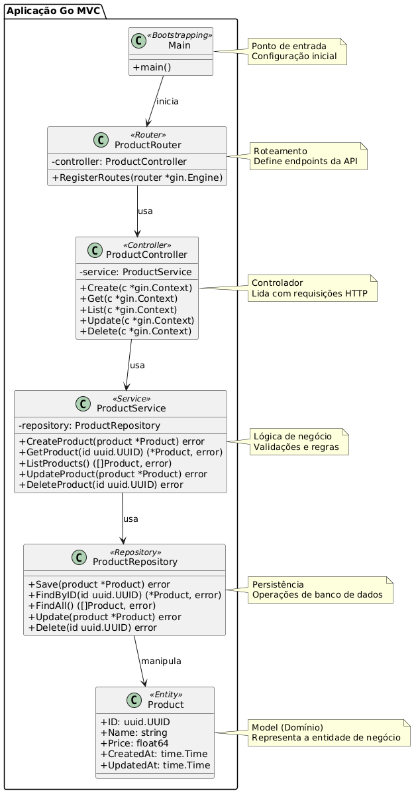

# Desafio Final - Proposta de arquitetura utilizando golang
Pós Arquitetura de Software e Soluções com IA - Desafio Final


*estrutura de pastas seguindo o padrão MVC*
```bash
product-api/
│
├── main.go                        // Ponto de entrada da aplicação
│
├── config/
│   └── database.go                // Inicialização do banco de dados
│
├── controller/
│   └── product_controller.go      // Controllers: manipulam as requisições
│
├── service/
│   └── product_service.go         // Regras de negócio
│
├── model/
│   └── product.go                 // Modelo de dados (entidade Produto)
│
├── repository/
│   └── product_repository.go      // Acesso a dados (CRUD com o banco)
│
└── router/
    └── router.go                  // Define os endpoints e rotas
```


*UML Class Diagram*

* Product                   *--> como entidade de domínio (Model)*
* ProductRepository         *--> como camada de persistência*
* ProductService            *--> com regras de negócio*
* ProductController         *--> responsável pelas requisições*
* product_router e main.go  *-->como bootstrapping da aplicação*





